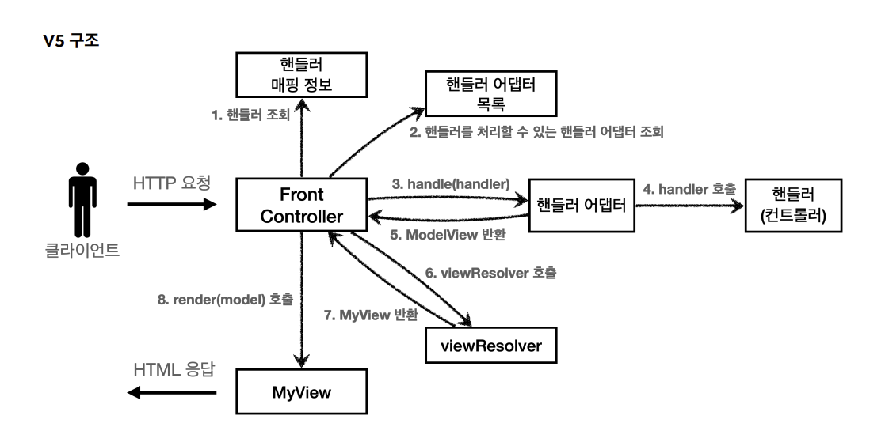

# 스프링 MVC 1편 - 백엔드 웹 개발 핵심 기술

### 섹션 1. 프레임 워크 만들기(완료)
### 섹션 2. 웹 애플리케이션 이해(완료)
### 섹션 3. 서블릿(완료)
### 섹션 4. 서블릿, JSP, MVC 패턴(완료)
### 섹션 5. 프레임 워크 만들기(완료)
    Spring MVC는 전부 인터페이스화 되어있음
    -> @어노테이션(컨트롤러)
    -> OCP를 잘 지킴: 인터페이스, 구현 분리가 잘 되어있음

인터페이스 따로, 구현은 구현대로 따로 로직 작성
